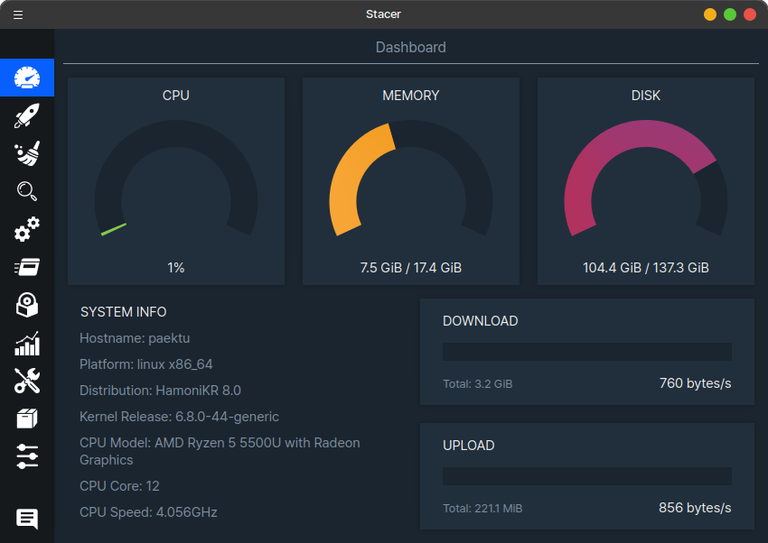
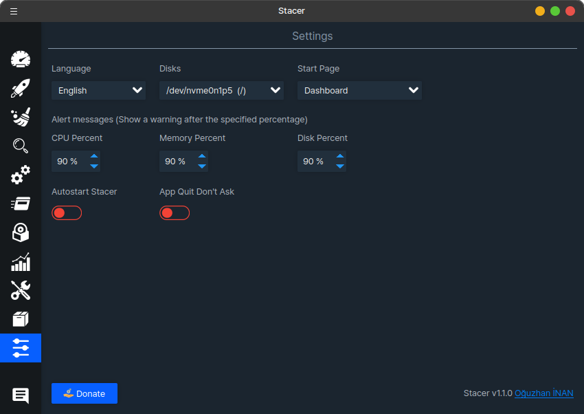
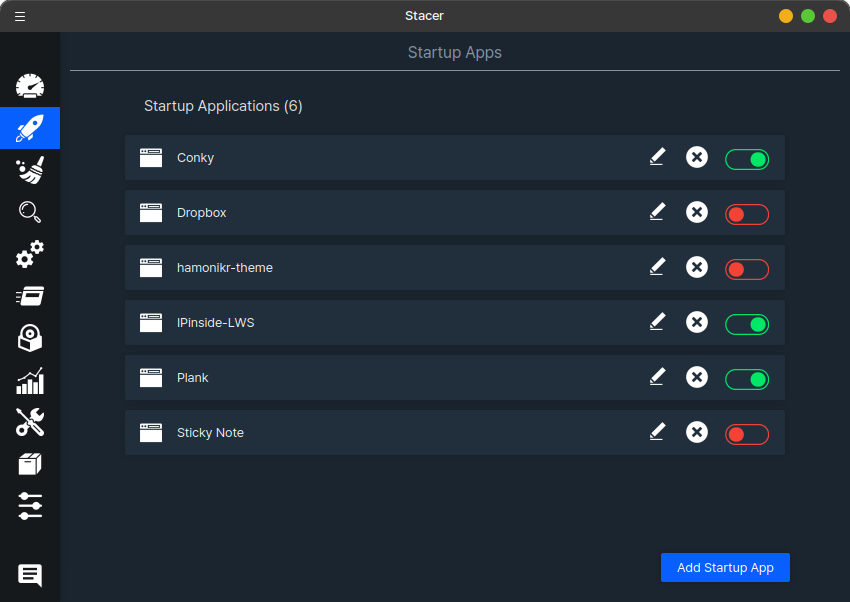
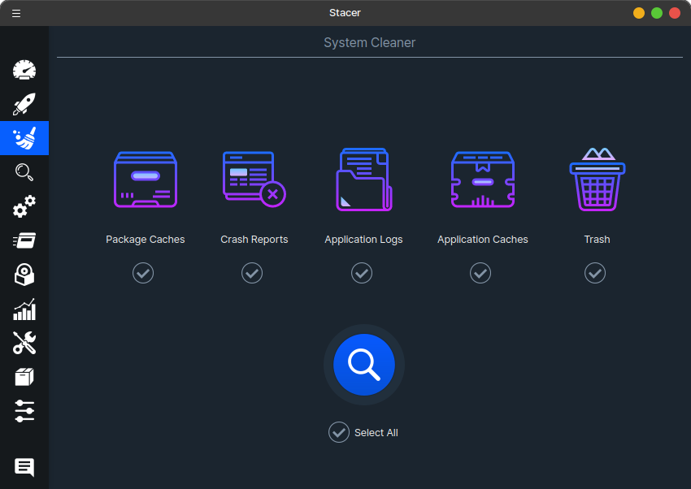
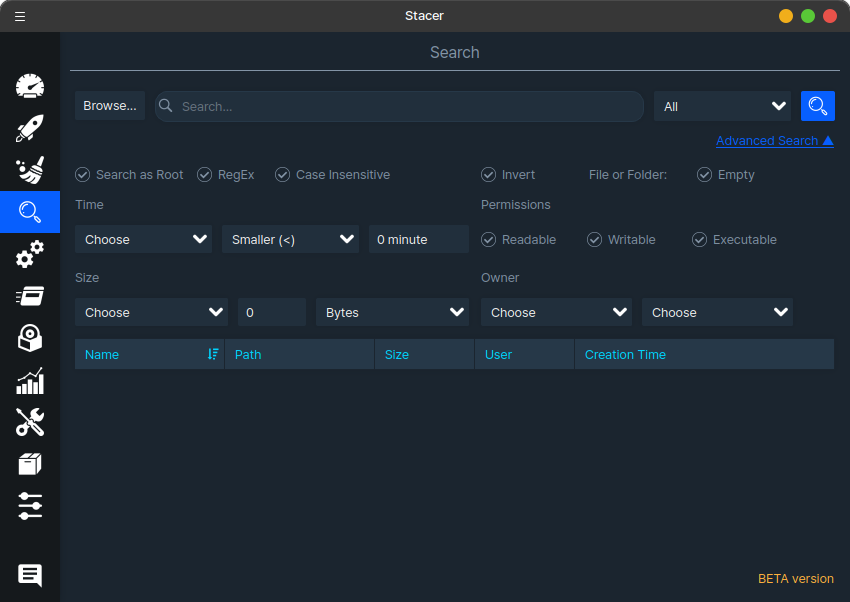
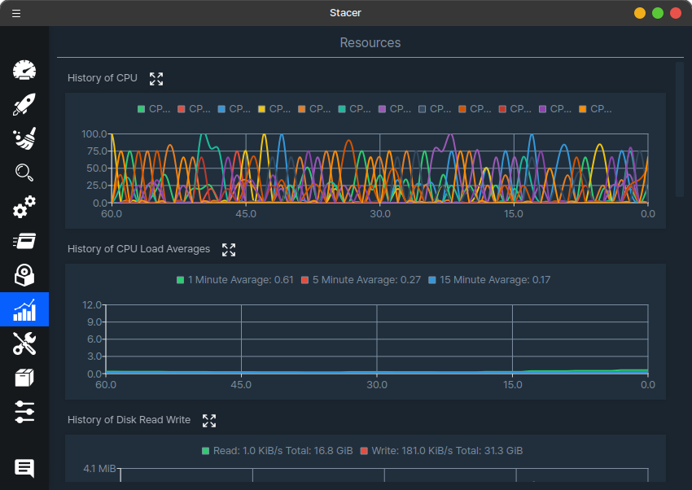
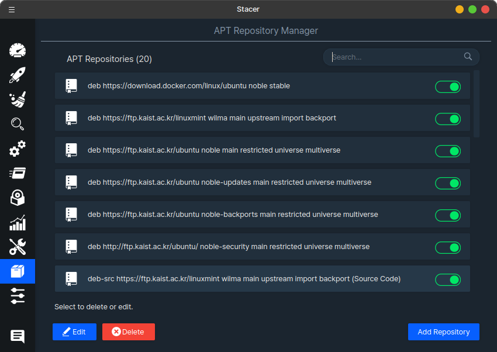

[English](#stacer) | [한국어](#시스템-관리-도구-stacer)

# stacer

HamoniKR Stacer is a system monitoring and service management tool. 

It is a fork of the upstream project [Stacer](https://github.com/oguzhaninan/Stacer), optimized for use in the HamoniKR OS environment.

## Key Features

- System Monitoring : Monitor CPU, memory, and disk usage in real-time.
- System Cleaner : Remove unnecessary files to free up space.
- Service Manager : Manage system services running on your machine.
- Package Management : Add or remove installed applications.
- APT Repository Manager : Manage APT repositories.
- Resource Usage Alerts : Set usage alerts for CPU, memory, disk, etc.

## Installation

You can download and install the latest .deb package from the [Releases page](https://github.com/hamonikr/hamonikr-stacer/releases) or use the following terminal commands:

### ubuntu (>=22.04)
```
wget -qO- https://repo.hamonikr.org/hamonikr-app.apt | sudo -E bash -

sudo apt install hamonikr-stacer
```

## Screenshots











## Build

### Compile from Source

```
# Build on Ubuntu 22.04

sudo add-apt-repository universe
sudo apt install -y qtcreator qtbase5-dev qt5-qmake cmake libqt5charts5-dev libqt5svg5-dev qttools5-dev ccache libfuse2

cd PROJECT_ROOT
mkdir build && cd build
cmake -DCMAKE_BUILD_TYPE=Release -DCMAKE_PREFIX_PATH=/usr/lib/x86_64-linux-gnu/qt5/bin ..
make -j $(nproc)
output/stacer
```

### Create deb package
```
./release.sh deb
```

For more details, refer to the [Build Documentation](./docs/BUILD)

# 시스템 관리 도구 stacer

시스템의 모니터링 및 시스템 서비스를 관리를 할 수 있는 프로그램 입니다.

[업스트림 프로젝트](https://github.com/oguzhaninan/Stacer)를 포크하여 하모니카OS 환경에서 사용할 수 있도록 배포하고 있습니다.

주요기능은 다음과 같습니다.

- 시스템 모니터링
- 불필요한 파일 제거 (시스템 클리너) 
- 시스템에 구동되는 서비스 관리
- 프로그램 추가 및 삭제
- APT 저장소 관리
- CPU, 메모리, 디스크 등의 사용량 알림


## 설치하기

[릴리즈 페이지](https://github.com/hamonikr/hamonikr-stacer/releases)에서 최신 버전의 deb 파일을 다운로드 받아서 설치하거나

또는 

터미널에서 다음과 같이 설치할 수 있습니다.

```
wget -qO- https://repo.hamonikr.org/hamonikr-app.apt | sudo -E bash -

sudo apt install hamonikr-stacer
```


## Screenshots


## Build from source

### Build from git source (Ubuntu 22.04)

```
sudo add-apt-repository universe
sudo apt install -y qtcreator qtbase5-dev qt5-qmake cmake libqt5charts5-dev libqt5svg5-dev qttools5-dev ccache libfuse2

cd PROJECT_ROOT
mkdir build && cd build
cmake -DCMAKE_BUILD_TYPE=Release -DCMAKE_PREFIX_PATH=/usr/lib/x86_64-linux-gnu/qt5/bin ..
make -j $(nproc)
output/stacer
```

## Build debian package
```
./release.sh deb
```

보다 자세한 내용은 [빌드하기 문서](docs/BUILD)를 참고하세요.
