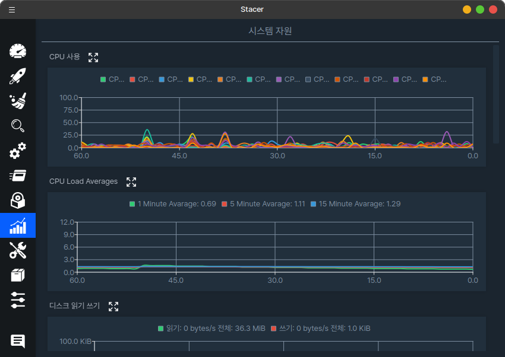

우분투 기반 시스템의 모니터링 및 시스템 관리를 할 수 있는 프로그램 입니다.

[업스트림 프로젝트](https://github.com/oguzhaninan/Stacer)를 포크하여 하모니카OS 환경에서 사용할 수 있도록 배포하고 있습니다.

주요기능은 다음과 같습니다.

- 시스템 모니터링
- 불필요한 파일 제거 (시스템 클리너) 
- 시스템에 구동되는 서비스 관리
- 프로그램 추가 및 삭제
- APT 저장소 관리
- CPU, 메모리, 디스크 등의 사용량 알림


## 설치하기

[릴리즈 페이지](https://github.com/hamonikr/hamonikr-stacer/releases)에서 최신 버전의 deb 파일을 다운로드 받아서 설치하거나

또는 

터미널에서 다음과 같이 설치할 수 있습니다.

```
wget -qO- https://repo.hamonikr.org/hamonikr-app.apt | sudo -E bash -

sudo apt install stacer=1.1.0-hamonikr8  
```

만약 다른 저장소(universe)에 있는 stacer 가 우선 순위가 높아서, 설치되지 않는 경우에는 다음과 같이 설치해주세요.
```
sudo apt install stacer=1.1.0-hamonikr8  
```


다른 환경에서 사용을 원하시면 아래 정보를 참고하세요.

### Fedora x64

1. Download `stacer_1.1.0_amd64.rpm` from the [Stacer releases page](https://github.com/oguzhaninan/Stacer/releases).
2. Run `sudo rpm --install stacer*.rpm --nodeps --force` on the downloaded package.
3. Launch Stacer using the installed `stacer` command.


## Screenshots





## Build from source

### Build from git source (Ubuntu 22.04)

```
sudo add-apt-repository universe
sudo apt install -y qtcreator qtbase5-dev qt5-qmake cmake libqt5charts5-dev libqt5svg5-dev qttools5-dev ccache libfuse2

cd PROJECT_ROOT
mkdir build && cd build
cmake -DCMAKE_BUILD_TYPE=Release -DCMAKE_PREFIX_PATH=/usr/lib/x86_64-linux-gnu/qt5/bin ..
make -j $(nproc)
output/stacer
```

## Build debian package
```
./release.sh deb
```

보다 자세한 내용은 [빌드하기 문서](docs/BUILD)를 참고하세요.
